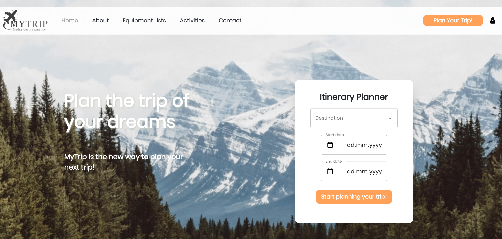
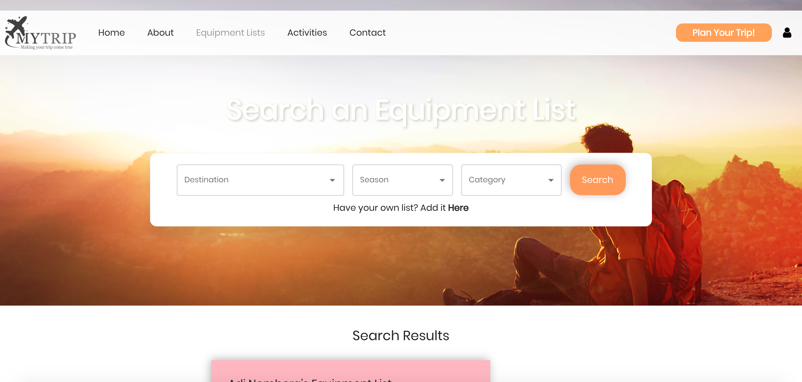
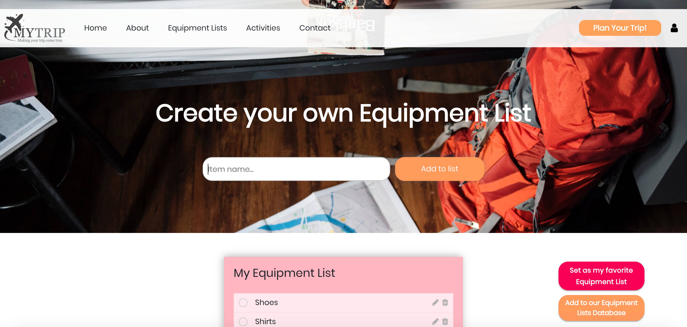

<h1 align="center">MyTrip</h1>

<p align="center">
  


</p>

<p align="center">
</p>

<h2 align="center"><a  href="https://mytrip.netlify.app">Live Demo</a></h2>

## Description

<p align="center">
</p>

<p align="center">
</p>

MyTrip is a free online trip planner that can help you plan and prepare for your next vacation.
You can save the restaurants you'll want to eat in, the hiking trails you'll want to explore, and the attractions you'll want to enjoy - all in one place!
You can also create and save your personal equipment list or search for an equipment list in our database (full of users' lists from trips around the world).
If there are details you don't want to forget such as important phone numbers, you can save them in your trip notes section.

## How to start planning your next trip?

### Signup / Signin with Google

- If you don't have an account yet, click on the "Plan your trip" button on the right corner of the screen.
- Sign up with your email and password, you can also add a profile picture.
- If you don't want to create an account, you can also sign in with your Google account.

<p align="center">
</p>


### Create your trip

- Use the form in the Home page or click on the "Plan your trip" button on the right corner of the screen.
- Enter your **Destination** and **Start and End dates**, and create a new trip!

<p align="center">
</p>
<p align="center">
</p>

### Add favorite activities to your trip

- In the Activities page you can choose activities according to your trip destination, season and category, and add them to your trip.
- You can also click on the activity title and see more information about it, and add it to your trip.

<p align="center">
</p>

### Add an equipment list to your trip

- In the Search an Equipment List page you can search for an equipment list according to your trip destination, season and category, and add it to your trip.
- You can also click on the "Add Equipment List" menu item, create your own equipment list, and add it to your trip.
- You can contribute to our site by adding your equipment list to out site database and help other travelers like you.

<p align="center">
</p>

<p align="center">
</p>

### Add and edit notes

- In your trip page you can write notes that will be saved immediately in your trip page.
- You can click on the "Clear notes" button if you wish to delete all the notes you wrote.

## Technologies used in the project

### React.js

- The project was created with create-react-app.
- I used **React** (with **Hooks**) for fast and dynamic components.
- State management is done with React **Context**, for easy and simple state management.

### CSS

- Each and every component is styled with **CSS**, and some components also use **Material-UI** in some places.
- The website is not responsive yet (compatible for desktop only).

### Firebase

- the project concentrates on the client side.
- The server side of the app is implemented with **Firebase Cloud Firestore**.

# Main Components

## **Home**

<p align="center">

</p>

## **MyTrip**

<p align="center">

</p>

## **ActivitySearch**

<p align="center">
</p>


## **EquipmentListSearch**

<p align="center">
</p>


## **PersonalEquipmentList**

<p align="center">
</p>


## **SignInUp**

<p align="center">

</p>

# Project setup

```
yarn install
yarn start
```

## Available Scripts

In the project directory, you can run:

### `yarn start`

Runs the app in the development mode.<br />
Open [http://localhost:3000](http://localhost:3000) to view it in the browser.

The page will reload if you make edits.<br />
You will also see any lint errors in the console.

### `yarn test`

Launches the test runner in the interactive watch mode.<br />
See the section about [running tests](https://facebook.github.io/create-react-app/docs/running-tests) for more information.

### `yarn build`

Builds the app for production to the `build` folder.<br />
It correctly bundles React in production mode and optimizes the build for the best performance.

The build is minified and the filenames include the hashes.<br />
Your app is ready to be deployed!

See the section about [deployment](https://facebook.github.io/create-react-app/docs/deployment) for more information.

### `yarn eject`

**Note: this is a one-way operation. Once you `eject`, you can’t go back!**

If you aren’t satisfied with the build tool and configuration choices, you can `eject` at any time. This command will remove the single build dependency from your project.

Instead, it will copy all the configuration files and the transitive dependencies (Webpack, Babel, ESLint, etc) right into your project so you have full control over them. All of the commands except `eject` will still work, but they will point to the copied scripts so you can tweak them. At this point you’re on your own.

You don’t have to ever use `eject`. The curated feature set is suitable for small and middle deployments, and you shouldn’t feel obligated to use this feature. However we understand that this tool wouldn’t be useful if you couldn’t customize it when you are ready for it.

## Learn More

You can learn more in the [Create React App documentation](https://facebook.github.io/create-react-app/docs/getting-started).

To learn React, check out the [React documentation](https://reactjs.org/).

### Code Splitting

This section has moved here: https://facebook.github.io/create-react-app/docs/code-splitting

### Analyzing the Bundle Size

This section has moved here: https://facebook.github.io/create-react-app/docs/analyzing-the-bundle-size

### Making a Progressive Web App

This section has moved here: https://facebook.github.io/create-react-app/docs/making-a-progressive-web-app

### Advanced Configuration

This section has moved here: https://facebook.github.io/create-react-app/docs/advanced-configuration

### Deployment

This section has moved here: https://facebook.github.io/create-react-app/docs/deployment

### `yarn build` fails to minify

This section has moved here: https://facebook.github.io/create-react-app/docs/troubleshooting#npm-run-build-fails-to-minify


# Future scope

- Add users' comments on activities.
- Make the site responsive for mobile devices and tablets.

